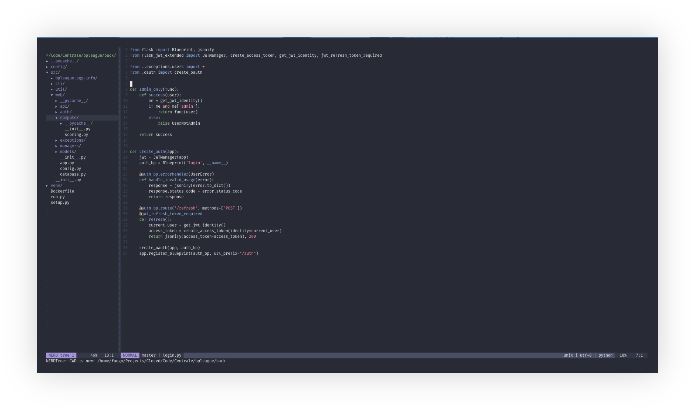

# Firark vim colorscheme

The Firark vim colorscheme is an implementation of the [Firark colors](https://github.com/alxkt/firark-colors) for the famous text editor Vim. Just copy the `firark.vim` file in your `~/.vim/colors/` folder and add the following lines to you `.vimrc` file :

```vim
colorscheme firark
```



